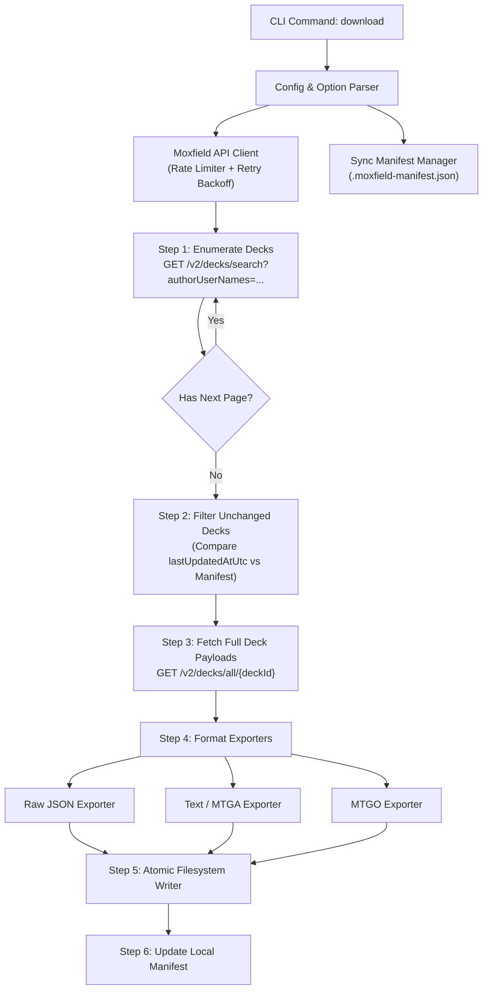

# ADR 0001: Architecture & Technical Specification for Moxfield Account Deck Downloader

* **Status**: Proposed
* **Date**: 2026-10-04
* **Author**: David Nuon / Antigravity Team
* **Deciders**: David Nuon
* **Consulted**: `mtg-expert`, `node-expert`, `git-tpm`

---

## 1. Context & Problem Statement

[Moxfield](https://www.moxfield.com) is one of the most widely used deck-building platforms for Magic: The Gathering. Users frequently store dozens or hundreds of decks across formats (Commander, Modern, Pioneer, Standard, Pauper, Limited, Cube).

Currently:
1. Moxfield provides individual deck export buttons (text, MTGO, Arena, Cockatrice), but **does not offer an automated "Export All Decks" feature** for a user account.
2. Users who want offline backups, archival copies, or local Git repositories of their deck collection must manually export each deck one by one.
3. Moxfield enforces Cloudflare protection and rate limits, meaning uncoordinated or naive bulk scraping risks 429 throttling, Cloudflare challenges, or IP bans.
4. Users need decks in multiple representations:
   - **Raw JSON**: High-fidelity preservation of card IDs, printing selections, foils, custom tags, and deck metadata.
   - **Universal Text / Arena format**: For quick import into MTG Arena, MTGO, Cockatrice, Archidekt, or tabletop proxy printers.

We need a dedicated, resilient CLI tool (`moxfield-downloader`) that can reliably enumerate and download all decks belonging to a specified Moxfield user account.

---

## 2. Decision Drivers

- **Data Fidelity**: Capture all deck sections (Commanders, Companions, Mainboard, Sideboard, Maybeboard/Considering, Signature Spells, Tokens).
- **Service Etiquette & Rate Limiting**: Moxfield is an active community service. The downloader must adhere to conservative request concurrency (1–2 requests concurrently), pacing delays (250–500ms), explicit User-Agent headers, and exponential backoff on HTTP 429/5xx.
- **Idempotency & Incremental Sync**: Running the tool repeatedly should only fetch decks that have been created or modified since the last run, minimizing bandwidth and API load.
- **Resilient File Organization**: Handle illegal filesystem characters in deck names (`/`, `\`, `:`, `*`, `?`, `"`, `<`, `>`, `|`), deck name collisions, and multiple organizational schemes (by format, by folder, or flat).
- **Extensible Export Formats**: Support multiple output formats simultaneously (`raw-json`, `text`, `arena`, `mtgo`).
- **Private & Unlisted Deck Support**: Allow users to optionally supply an authentication token to export their own private or unlisted decks.

---

## 3. Proposed Architecture & System Design



---

## 4. API Specification & Integration Mechanics

### 4.1. Deck Enumeration (Listing User Decks)
* **Endpoint**: `GET https://api2.moxfield.com/v2/decks/search`
* **Query Parameters**:
  - `pageNumber`: 1-indexed page integer.
  - `pageSize`: Max batch size (recommended: `64`).
  - `authorUserNames`: Target Moxfield username.
  - `sortType`: `updated`
  - `sortDirection`: `descending`
  - `showIllegal`: `true`
* **Response Schema (Abbreviated)**:
  ```json
  {
    "pageNumber": 1,
    "pageSize": 64,
    "totalResults": 115,
    "totalPages": 2,
    "data": [
      {
        "id": "k8X1j2n34A",
        "name": "Atraxa Superfriends",
        "format": "commander",
        "visibility": "public",
        "publicUrl": "https://www.moxfield.com/decks/k8X1j2n34A",
        "viewCount": 150,
        "likeCount": 12,
        "commentCount": 3,
        "isUnlisted": false,
        "hasEnhancedDeckView": false,
        "lastUpdatedAtUtc": "2026-09-15T18:24:02.123Z",
        "createdAtUtc": "2024-01-10T12:00:00.000Z"
      }
    ]
  }
  ```

### 4.2. Full Deck Retrieval
* **Endpoint**: `GET https://api2.moxfield.com/v2/decks/all/{deckId}`
* **Headers**:
  - `User-Agent`: `MoxfieldDownloader/<version> (+https://github.com/davidnuon/moxfield-downloader)`
  - `Authorization`: `Bearer <token>` *(optional, if private/unlisted decks are requested)*
  - `Accept`: `application/json`
* **Payload Structure**:
  - `boards.commanders.cards`: Dictionary of commander cards with quantities and card metadata.
  - `boards.companions.cards`: Companion cards (if applicable).
  - `boards.mainboard.cards`: Main library card collection.
  - `boards.sideboard.cards`: Sideboard cards.
  - `boards.considering.cards`: Maybeboard / considering list.
  - `boards.signatureSpells.cards`: Oathbreaker signature spells (if applicable).
  - `boards.attractions.cards` & `boards.stickers.cards`: Unfinity attractions and sticker sheets.

### 4.3. Rate Limiting, Concurrency, and Backoff Policy
- **Concurrency Limit**: Maximum 2 concurrent HTTP requests.
- **Inter-request Delay**: Default 350ms throttle between sequential requests.
- **Cloudflare & Rate-Limit Handling**:
  - On `429 Too Many Requests`: Extract `Retry-After` header if present; otherwise apply exponential backoff with jitter (`backoffMs * 2^(attempt) + random(0, 500)`).
  - On `5xx Server Error`: Retry up to 3 times before failing the specific deck.
  - Failure Isolation: A failure downloading a single deck should report a warning and continue the rest of the queue, logging failed IDs to a summary report.

---

## 5. Storage & File Organization

### 5.1. Directory Structure Options
By default, decks will be grouped by format to avoid cluttering a single directory with hundreds of files.

```text
<output-dir>/
├── .moxfield-manifest.json       # Incremental sync tracking state
├── commander/
│   ├── Atraxa Superfriends [k8X1j2n34A]/
│   │   ├── deck.json             # Raw Moxfield schema
│   │   ├── deck.txt              # Standard MTG / MTGA export
│   │   └── deck.mtgo.txt         # MTGO format (with sideboard separation)
│   └── Urza Lord High Artificer [p9Y2m4k11B]/
│       ├── deck.json
│       └── deck.txt
└── modern/
    └── Izzet Murktide [q3R7t8v99C]/
        ├── deck.json
        └── deck.txt
```

Users can also specify `--group-by none` for a flat directory or `--flat-files` where each deck is a single file rather than a subfolder (e.g. `./decks/commander/Atraxa Superfriends [k8X1j2n34A].txt`).

### 5.2. File Name Sanitization
Moxfield deck titles can contain emojis, quotes, slashes, or reserved characters (e.g., `Urza // Mishra: The Brothers' War?`).
- Characters `\ / : * ? " < > |` and control characters (`\0-\x1f`) are replaced with `-` or removed.
- Deck titles are truncated to 100 characters to prevent filesystem path length overflows.
- Every deck filename or folder includes the unique Moxfield alphanumeric deck ID in brackets (e.g. `[k8X1j2n34A]`) to guarantee uniqueness even if two decks share the exact same title.

---

## 6. Incremental Sync & Manifest

To ensure high performance and prevent unnecessary API requests, the downloader maintains a local manifest: `.moxfield-manifest.json` in the root of the output directory.

```json
{
  "version": 1,
  "username": "davidnuon",
  "lastSyncUtc": "2026-10-04T22:00:00.000Z",
  "decks": {
    "k8X1j2n34A": {
      "name": "Atraxa Superfriends",
      "format": "commander",
      "lastUpdatedAtUtc": "2026-09-15T18:24:02.123Z",
      "downloadedAtUtc": "2026-10-04T22:00:05.120Z",
      "files": [
        "commander/Atraxa Superfriends [k8X1j2n34A]/deck.json",
        "commander/Atraxa Superfriends [k8X1j2n34A]/deck.txt"
      ]
    }
  }
}
```

### Sync Logic:
1. Fetch all deck summaries for the user via search pagination.
2. For each deck in the search results:
   - Check if `deck.id` exists in the local manifest.
   - If `deck.lastUpdatedAtUtc <= manifest.decks[deck.id].lastUpdatedAtUtc` and `--force` is not passed:
     - **Skip downloading** (Mark as *Up to date*).
   - If `lastUpdatedAtUtc` is newer or deck is missing:
     - **Queue for download**.
3. When download succeeds, atomically write files and update the manifest.

---

## 7. Supported Export Formats

| Format Identifier | File Extension | Description | Example Content |
| :--- | :--- | :--- | :--- |
| `json` | `.json` | Full raw JSON response from `/v2/decks/all/{id}` | Complete Moxfield data structure |
| `text` / `arena` | `.txt` | Standard format compatible with MTG Arena, Scryfall, and Moxfield import | `COMMANDER`<br>`1 Atraxa, Praetors' Voice (CM2) 1`<br><br>`DECK`<br>`1 Sol Ring (C21) 263`<br><br>`SIDEBOARD`<br>`...` |
| `mtgo` | `.mtgo.txt` | Magic: The Gathering Online format | Mainboard lines, blank line, then `SB: <qty> <card>` |

---

## 8. CLI Command Specification

```bash
moxfield-downloader download <username> [options]
```

### Arguments & Flags:
- `<username>` *(required)*: The Moxfield username whose decks should be downloaded.
- `-o, --output <dir>`: Destination directory for downloaded decks (default: `./decks`).
- `-f, --format <formats>`: Comma-separated list of formats: `json`, `text`, `arena`, `mtgo` (default: `text,json`).
- `--group-by <type>`: Folder grouping strategy: `format`, `none` (default: `format`).
- `--flat`: Output files directly without creating a subfolder for each deck.
- `--include-considering`: Include maybeboard / considering section in text exports (default: `true`).
- `--no-incremental`: Force re-downloading all decks, ignoring the manifest.
- `--concurrency <n>`: Maximum parallel downloads (default: `2`, max: `4`).
- `--delay <ms>`: Delay between sequential requests in milliseconds (default: `350`).
- `--token <jwt>`: Optional Moxfield session/bearer token to access private/unlisted decks.
- `--dry-run`: Enumerate decks and report what would be downloaded without making file writes.
- `--verbose`: Enable detailed request and debugging logs.

---

## 9. Implementation Plan & Phases

Mapped to our `git-program-management` and `nodejs-engineering` guidelines:

- **PR 1 (Foundation)**:
  - Setup `package.json`, `tsconfig.json` (NodeNext/ESM), and testing framework (Vitest).
  - Define TypeScript domain types for Moxfield search results, deck objects, and manifest.
- **PR 2 (API Client & Rate Limiter)**:
  - Implement `MoxfieldClient` with pagination, concurrency queue, and exponential backoff retry.
  - Add mock HTTP tests for 429 throttling and pagination termination.
- **PR 3 (Format Exporters & Sanitization)**:
  - Implement text, Arena, MTGO, and JSON serialization engines.
  - Implement safe filesystem filename sanitization.
- **PR 4 (Manifest & Sync Engine)**:
  - Implement `ManifestManager` for atomic `.moxfield-manifest.json` reads, updates, and diffing.
- **PR 5 (CLI Application & Progress UX)**:
  - Wire up CLI commands using a lightweight parser (`cac` or `commander`).
  - Add terminal progress indication and summary reporting.
  - Validate end-to-end execution against real public Moxfield decks.

---

## 10. Consequences & Risks

### Positive
- Users gain a one-command, automated backup solution for their entire Moxfield collection.
- Incremental sync ensures subsequent runs execute in seconds with minimal bandwidth.
- Formats produced are instantly usable across tabletop proxy engines, MTGA, and MTGO.
- Respects Moxfield infrastructure to avoid IP blocks.

### Risks & Mitigations
- **Risk**: Moxfield uses an internal/undocumented v2 API that could change endpoint structures.
  - *Mitigation*: Validate API responses using schema checks; store raw JSON so data is never lost even if text parsers encounter unexpected attributes.
- **Risk**: Cloudflare bot protection on Moxfield endpoints.
  - *Mitigation*: Sensible user-agent strings, strict rate pacing (350ms delay), conservative concurrency (2 max), and optional bearer token support.
