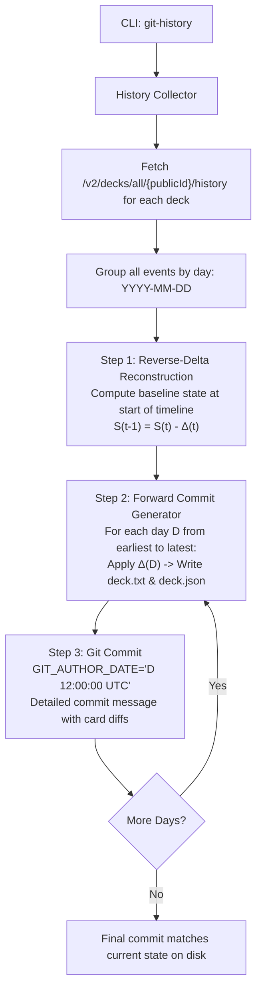

# ADR 0002: Deck Edit History & Git Commit Generator

* **Status**: Proposed
* **Date**: 2026-10-04
* **Author**: David Nuon / Antigravity Team
* **Deciders**: David Nuon
* **Consulted**: `git-tpm`, `mtg-expert`, `node-expert`

---

## 1. Context & Problem Statement

Users backing up their Moxfield collections to a Git repository often end up with a single monolithic commit containing all decks at once. This obscures the history of when decks were actually built, updated, and tweaked over the months or years.

Moxfield maintains a chronological changelog of card edit events for each deck via `GET /v2/decks/all/{publicId}/history`. Each event records:
- The card object (name, set, collector number, etc.)
- The board type (`mainboard`, `sideboard`, `commanders`, `maybeboard`)
- The quantity delta (`+1` for additions, `-1` for removals)
- The exact timestamp (`updatedAtUtc`)

We need a dedicated command—`moxfield-downloader git-history <username>`—that can:
1. Enumerate all decks and fetch their complete edit histories from Moxfield.
2. Group all edit events across all decks by calendar day (`YYYY-MM-DD`).
3. Reconstruct the state of each deck at each historical date.
4. Generate a synthetic Git commit history grouped by day, where each commit carries the appropriate historical author and committer dates, with a commit message documenting which cards were added and removed.

---

## 2. Decision Drivers

- **Chronological Accuracy**: Group edits by calendar date and assign `GIT_AUTHOR_DATE` and `GIT_COMMITTER_DATE` to match the actual day of edits.
- **State Convergence**: The final commit in the generated history must match the current deck state on disk (zero drift or discrepancy).
- **Reverse-Delta Reconstruction**: Starting from the verified current deck state and subtracting daily deltas backwards guarantees that any cards added prior to recorded changelog events remain preserved in the baseline.
- **Informative Commit Messages**: Each daily commit should include a human-readable summary listing the decks modified and individual card additions (`+ 1 Card Name`) and removals (`- 1 Card Name`).
- **Flexible Git Targeting**: Support generating history on a dedicated branch (e.g. `--branch history` or `--branch main`) without destroying untracked files or uncommitted changes.
- **Local History Caching**: Cache fetched history locally (`history.json` or `.moxfield-history.json`) to avoid repeated network requests on subsequent runs.

---

## 3. System Architecture & Replay Algorithm



### 3.1. Reverse-Delta Reconstruction Algorithm
1. Start with the verified current deck states $S_{current}$ (as loaded from `deck.json`).
2. Order all days containing edits chronologically: $D_1, D_2, \dots, D_N$.
3. To determine the state before $D_1$ (the initial baseline):
   $$\text{For each day } D_k \text{ from } D_N \text{ down to } D_1:$$
   - For each $+1$ event on $D_k$: decrement the card count in the board by 1.
   - For each $-1$ event on $D_k$: increment the card count in the board by 1.
4. Decks whose creation date (`createdAtUtc`) is after day $D$ are marked as not yet created and are omitted from commits prior to their creation date.
5. In the forward pass, starting from the baseline, on each day $D_k$:
   - Apply the day's delta.
   - Render `deck.txt` and `deck.json`.
   - Stage and commit with the formatted date.

---

## 4. Commit Message Format

```text
chore(decks): deck edits on 2026-09-01

Ashaya's Enduring Bond [AjqAd5]:
  + 1 Apex Devastator (mainboard)
  + 1 Aurora Phoenix (mainboard)
  + 1 Bigger on the Inside (mainboard)
  - 1 Bigger on the Inside (mainboard)

[EDH] Redwall [nr0JqR]:
  + 1 Mabel, Heir to Cragflame (commanders)
```

---

## 5. CLI Specification

```bash
moxfield-downloader git-history <username> [options]
```

### Options:
- `-d, --dir <path>`: Target git repository directory (default: current working directory).
- `-b, --branch <name>`: Branch to write commits to (default: `history`).
- `--orphan`: Create branch as an orphan branch (disconnected root) (default: `true`).
- `--author-name <name>`: Name for git commit author (default: Moxfield username).
- `--author-email <email>`: Email for git commit author (default: `<username>@users.noreply.moxfield.com`).
- `--include-considering`: Include maybeboard / considering edits (default: `true`).
- `--dry-run`: Preview daily commits and changed card counts without executing git commands.
